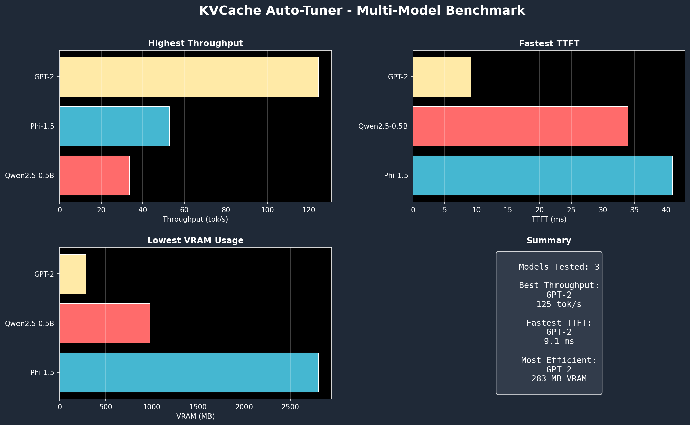
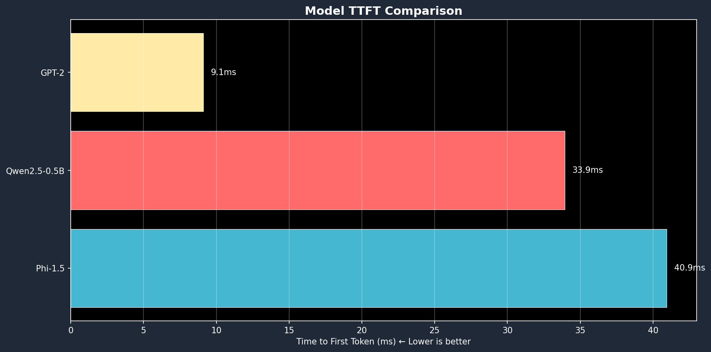
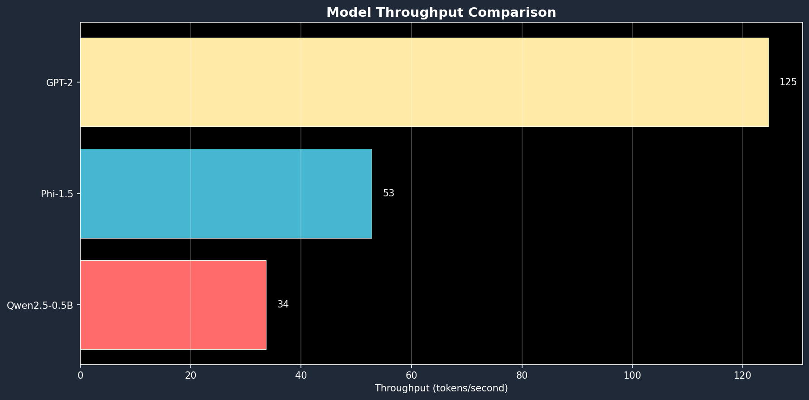
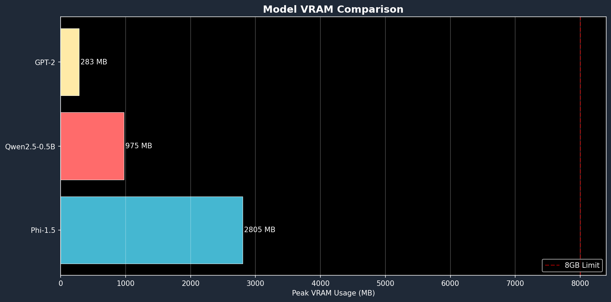
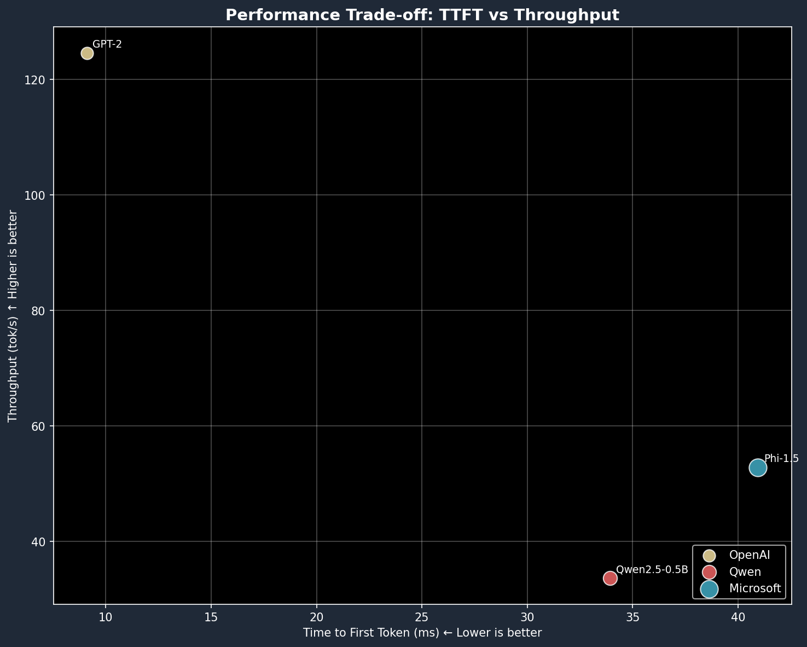
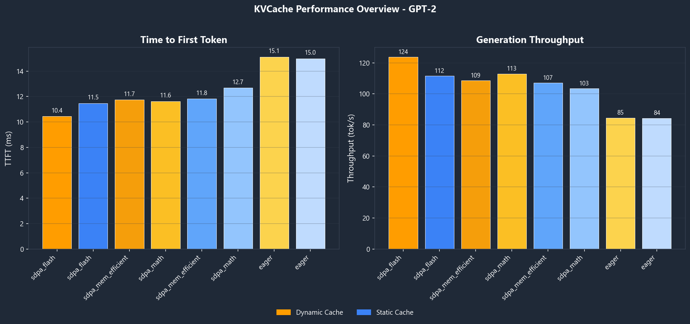
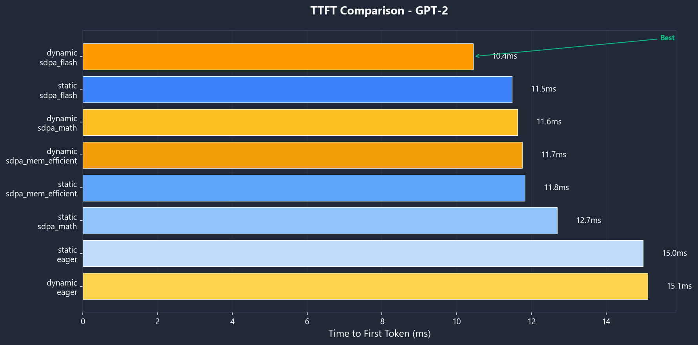
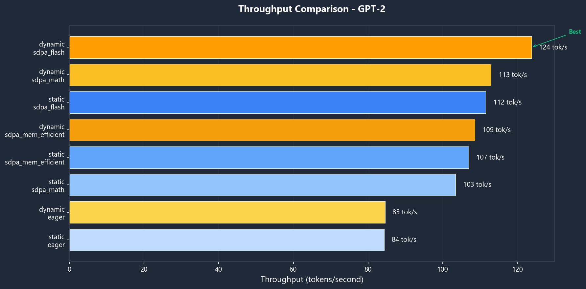
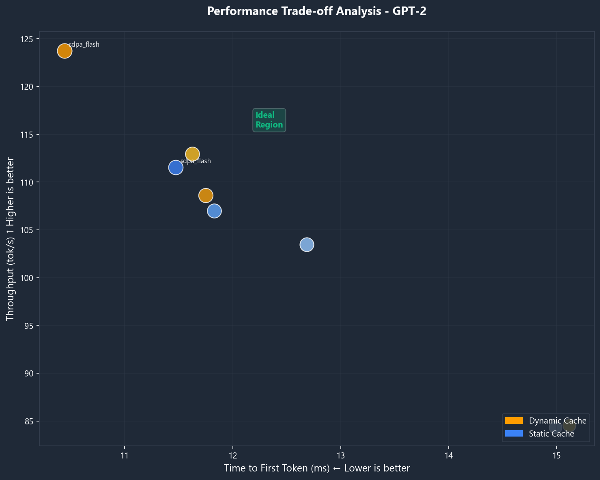

# KVCache Auto-Tuner

<p align="center">
  
</p>

<p align="center">
  <strong>Automatic KV-Cache Optimization for HuggingFace Transformers</strong>
</p>

<p align="center">
  <a href="https://github.com/Keyvanhardani/kvcache-autotune/actions"></a>
  <a href="https://pypi.org/project/kvcache-autotune/"></a>
  <a href="https://pypi.org/project/kvcache-autotune/"></a>
  <a href="https://github.com/Keyvanhardani/kvcache-autotune/blob/main/LICENSE"></a>
</p>

<p align="center">
  <a href="#features">Features</a> •
  <a href="#installation">Installation</a> •
  <a href="#quick-start">Quick Start</a> •
  <a href="#benchmark-results">Benchmarks</a> •
  <a href="#roadmap">Roadmap</a>
</p>

---

**KVCache Auto-Tuner** automatically finds the optimal KV-cache configuration for your model, hardware, and workload. Stop guessing which cache strategy, attention backend, or dtype works best—let the tuner find it for you.

## Why KVCache Auto-Tuner?

Modern LLM inference involves many configuration choices:

| Configuration | Options | Impact |
|--------------|---------|--------|
| **Cache Strategy** | Dynamic, Static, Sliding Window | Memory usage, prefill speed |
| **Attention Backend** | SDPA Flash, Memory Efficient, Math, Eager | Throughput, VRAM |
| **Data Type** | bfloat16, float16, float32 | Speed vs precision trade-off |
| **Compilation** | torch.compile modes | Startup vs runtime speed |

The optimal combination depends on your specific model, hardware, and use case. **KVCache Auto-Tuner benchmarks these combinations systematically** and provides a production-ready configuration.

## Performance Improvement

**See the difference KVCache Auto-Tuner makes!** Our plugin optimizes your Transformers inference automatically.

<p align="center">
  
</p>

### Baseline vs Optimized

| Model | Baseline | Optimized | Throughput | TTFT |
|-------|----------|-----------|------------|------|
| **GPT-2** | 118.1 tok/s | 120.2 tok/s | **+1.8%** | **+3.7%** |
| **Qwen2.5-0.5B** | 28.7 tok/s | 29.5 tok/s | **+2.7%** | **+1.6%** |
| **Phi-1.5** | 45.2 tok/s | 45.6 tok/s | **+0.9%** | **+5.1%** |

<table>
<tr>
<td width="50%">

</td>
<td width="50%">

</td>
</tr>
</table>

> **Note**: Results vary by model and hardware. Larger improvements are typical for models that benefit from Flash Attention and dynamic caching.

## Multi-Model Benchmark Results

<p align="center">
  
</p>

### Model Comparison

| Model | Family | Params | TTFT (ms) | Throughput | VRAM | Best Config |
|-------|--------|--------|-----------|------------|------|-------------|
| **GPT-2** | OpenAI | 124M | 9.1 | 124.6 tok/s | 283MB | dynamic/sdpa_flash |
| **Phi-1.5** | Microsoft | 1.3B | 40.9 | 52.8 tok/s | 2.8GB | dynamic/sdpa_flash |
| **Qwen2.5-0.5B** | Qwen | 0.5B | 33.9 | 33.6 tok/s | 975MB | dynamic/eager |

### Performance Comparison

<table>
<tr>
<td width="50%">

</td>
<td width="50%">

</td>
</tr>
</table>

### VRAM Efficiency

<table>
<tr>
<td width="50%">

</td>
<td width="50%">

</td>
</tr>
</table>

> **Benchmark Setup**: NVIDIA RTX 4060 (8GB), Windows 11, Python 3.12, Transformers 4.52+

### Single Model Analysis (GPT-2)

<p align="center">
  
</p>

<table>
<tr>
<td width="50%">

</td>
<td width="50%">

</td>
</tr>
</table>

<p align="center">
  
</p>

## Features

- **Automatic Optimization**: Find the best configuration without manual experimentation
- **Multiple Profiles**: Built-in presets for Chat/Agent, RAG, and Longform workloads
- **Custom Workloads**: Define your own profiles with specific context/output lengths
- **Production-Ready Output**: Get drop-in Python code snippets and JSON plans
- **Beautiful Reports**: Markdown and HTML reports with performance comparisons
- **Early Stopping**: Smart pruning of dominated configurations for faster results
- **Extensible Architecture**: Adapter-based design for vLLM/llama.cpp/Ollama support

## Installation

```bash
# Basic installation
pip install kvat

# With all dependencies (recommended)
pip install kvat[full]
```

### From Source

```bash
git clone https://github.com/Keyvanhardani/kvcache-autotune.git
cd kvcache-autotune
pip install -e ".[full,dev]"
```

## Quick Start

### CLI Usage

```bash
# Basic tuning with chat-agent profile
kvat tune meta-llama/Llama-3.2-1B --profile chat-agent

# RAG workload with custom context lengths
kvat tune mistralai/Mistral-7B-v0.1 --profile rag --context 8192,16384,32768

# Quick test with ci-micro profile
kvat tune gpt2 --profile ci-micro -v

# Apply a saved plan
kvat apply ./kvat_results/best_plan.json --print-snippet

# Compare two configurations
kvat compare baseline_plan.json new_plan.json

# List available profiles
kvat profiles

# System info
kvat info
```

### Python API

```python
from kvat.core.schema import TuneConfig, DeviceType
from kvat.core.profiles import get_profile
from kvat.engines.transformers import TransformersAdapter
from kvat.core.search import TuningSearch
from kvat.core.planner import PlanBuilder

# Configure tuning
config = TuneConfig(
    model_id="meta-llama/Llama-3.2-1B",
    device=DeviceType.CUDA,
    profile=get_profile("chat-agent"),
    output_dir="./results",
)

# Run optimization
adapter = TransformersAdapter()
search = TuningSearch(config=config, adapter=adapter)
result = search.run()

# Get production-ready code
planner = PlanBuilder(result)
print(planner.generate_code_snippet())
```

## Profiles

KVCache Auto-Tuner includes optimized profiles for common workloads:

| Profile | Context | Output | Optimization Focus |
|---------|---------|--------|-------------------|
| `chat-agent` | 2-8K | 64-256 | **TTFT** (50%) - Minimize latency |
| `rag` | 8-32K | 256-512 | **Balanced** (35/35/30) |
| `longform` | 4-8K | 1-2K | **Throughput** (50%) |
| `ci-micro` | 512 | 32 | Quick CI validation |

### Custom Profiles

```python
from kvat.core.profiles import create_custom_profile

profile = create_custom_profile(
    name="my-workload",
    context_lengths=[4096, 8192],
    output_lengths=[256, 512],
    weight_ttft=0.4,
    weight_throughput=0.4,
    weight_memory=0.2,
)
```

## Output

KVCache Auto-Tuner generates:

| File | Description |
|------|-------------|
| `best_plan.json` | Complete configuration with metrics and fallback rules |
| `optimized_config.py` | Drop-in Python code for your inference pipeline |
| `report.md` | Human-readable summary with rankings |
| `report.html` | Visual report with charts and styling |

### Example Output

```
┌─────────────────────────────────────────────────────────────────────────────┐
│ Best Configuration                                                          │
│                                                                             │
│ Cache Strategy: dynamic                                                     │
│ Attention Backend: sdpa_flash                                               │
│ Data Type: bfloat16                                                         │
│ torch.compile: False                                                        │
│                                                                             │
│ Score: 100.00                                                               │
│ Confidence: 80%                                                             │
└─────────────────────────────────────────────────────────────────────────────┘
                         Top Configurations
┌───┬────────────────────────────┬────────┬───────────┬─────────────┐
│ # │ Config                     │ Score  │ TTFT (ms) │ Throughput  │
├───┼────────────────────────────┼────────┼───────────┼─────────────┤
│ 1 │ dynamic/sdpa_flash         │ 100.00 │ 10.15     │ 123.1 tok/s │
│ 2 │ dynamic/sdpa_mem_efficient │ 100.00 │ 10.38     │ 115.6 tok/s │
│ 3 │ static/sdpa_flash          │ 100.00 │ 15.18     │ 112.3 tok/s │
└───┴────────────────────────────┴────────┴───────────┴─────────────┘
```

## Architecture

```
kvat/
├── core/
│   ├── schema.py      # Pydantic data models
│   ├── metrics.py     # TTFT, throughput, scoring
│   ├── profiles.py    # Workload profiles
│   ├── search.py      # Grid search with pruning
│   ├── planner.py     # Plan generation
│   └── report.py      # Markdown/HTML reports
├── engines/
│   ├── base.py        # EngineAdapter interface
│   └── transformers.py # HuggingFace adapter
├── probes/
│   ├── gpu.py         # CUDA memory tracking
│   └── cpu.py         # RAM monitoring
└── cli.py             # Typer CLI
```

## Roadmap

### v0.1.0 (Current Release)
- [x] Core tuning engine with grid search
- [x] HuggingFace Transformers adapter
- [x] CLI interface (`kvat tune`, `kvat apply`, `kvat compare`)
- [x] Markdown & HTML reports
- [x] Built-in profiles (chat-agent, rag, longform)
- [x] CUDA/GPU memory tracking
- [x] Windows & Linux support

### v0.2.0 (Next)
- [ ] Batch size optimization
- [ ] CPU offload strategies
- [ ] `kvat watch` - Continuous monitoring
- [ ] Benchmark visualization export
- [ ] Profile recommendations based on hardware

### v0.3.0 (Planned)
- [ ] **Ollama adapter** - Local model optimization
- [ ] **llama.cpp adapter** - GGUF model support
- [ ] **vLLM adapter** - Production serving optimization
- [ ] Quantized KV-cache (INT8/INT4)
- [ ] Multi-GPU configurations

### v1.0.0 (Future)
- [ ] HuggingFace Hub integration
- [ ] Cloud deployment recommendations
- [ ] A/B testing framework
- [ ] Real-time inference monitoring

## Contributing

Contributions are welcome! Please see our [Contributing Guide](CONTRIBUTING.md) for details.

```bash
# Setup development environment
pip install -e ".[dev]"

# Run tests
pytest tests/ -v

# Run linting
ruff check kvat/
```

## License

Apache 2.0 - See [LICENSE](LICENSE) for details.

## Citation

If you use KVCache Auto-Tuner in your research, please cite:

```bibtex
@software{kvcache_autotune,
  title = {KVCache Auto-Tuner: Automatic KV-Cache Optimization for Transformers},
  author = {Keyvanhardani},
  year = {2025},
  url = {https://github.com/Keyvanhardani/kvcache-autotune}
}
```

---

<p align="center">
  Made with dedication for the HuggingFace community
</p>
