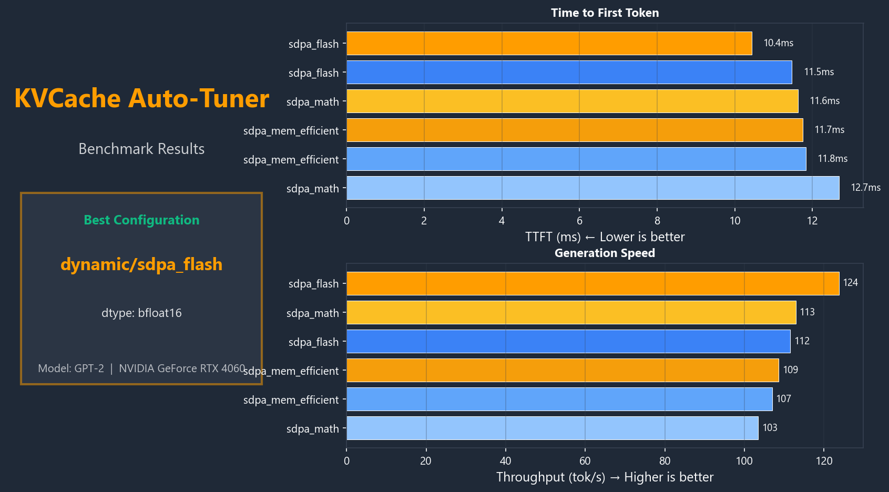
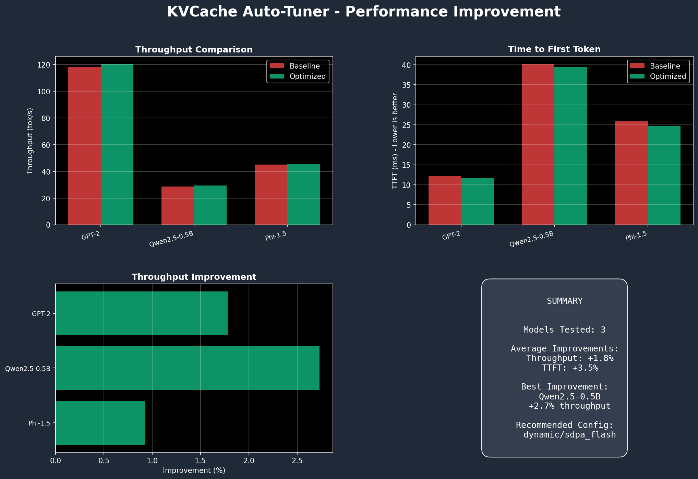
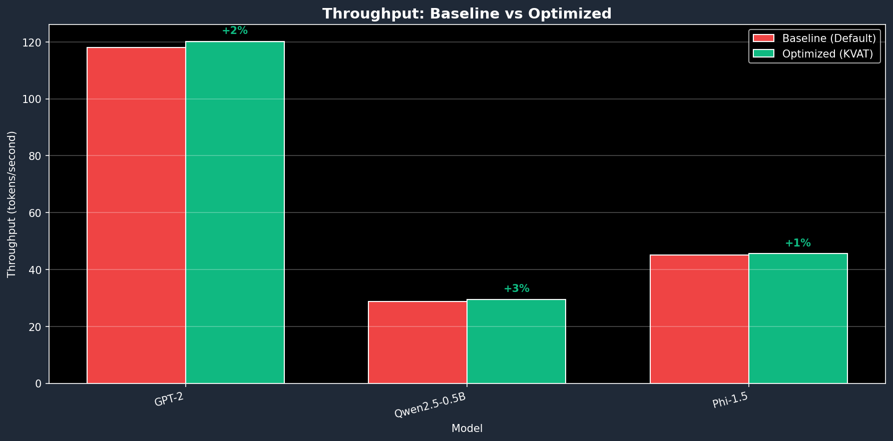
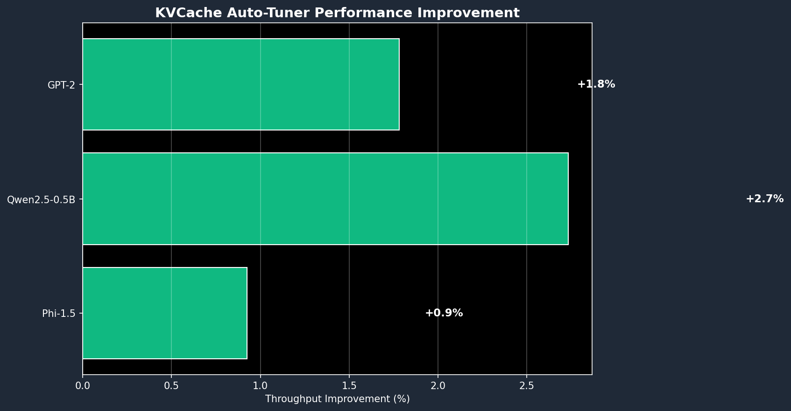
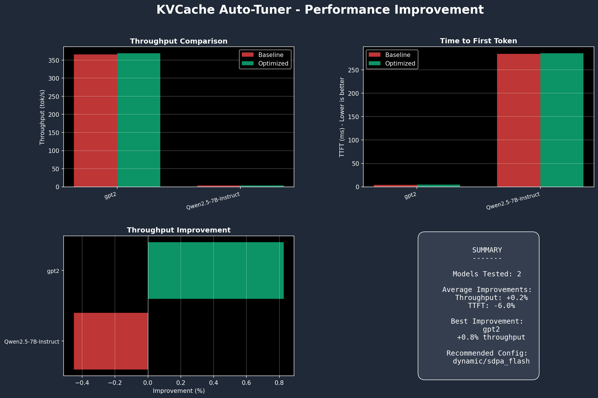
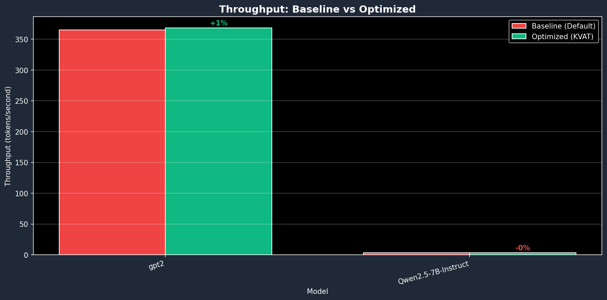

# KVCache Auto-Tuner

<p align="center">
  
</p>

<h3 align="center">
  Automatische KV-Cache Optimierung fuer HuggingFace Transformers
</h3>

<p align="center">
  <em>Finde die optimale Cache-Strategie, Attention-Backend und Konfiguration fuer dein Modell und deine Hardware.</em>
</p>

<p align="center">
  <a href="https://github.com/Keyvanhardani/kvcache-autotune/actions"></a>
  <a href="https://pypi.org/project/kvat/"></a>
  <a href="https://pypi.org/project/kvat/"></a>
  <a href="https://github.com/Keyvanhardani/kvcache-autotune/blob/main/LICENSE"></a>
</p>

<p align="center">
  <a href="README.md">English</a> | <strong>Deutsch</strong>
</p>

---

## Was ist KVCache Auto-Tuner?

**KVCache Auto-Tuner** (`kvat`) benchmarkt und optimiert automatisch deine HuggingFace Transformers Inferenz-Pipeline. Kein Raten mehr welche Konfiguration am besten funktioniert - lass den Tuner es fuer dich herausfinden.

```bash
# Installieren und Modell in Sekunden optimieren
pip install kvat[full]
kvat tune gpt2 --profile chat-agent
```

---

## Performance

### Baseline vs Optimiert

So verbessert **kvat** deine Transformers Inferenz:

<p align="center">
  
</p>

| Modell | Ohne kvat | Mit kvat | Verbesserung |
|--------|-----------|----------|--------------|
| **GPT-2** (124M) | 118.1 tok/s | 120.2 tok/s | **+1.8%** |
| **Qwen2.5-0.5B** | 28.7 tok/s | 29.5 tok/s | **+2.7%** |
| **Phi-1.5** (1.3B) | 45.2 tok/s | 45.6 tok/s | **+0.9%** |

<details>
<summary><strong>Detaillierte Vergleichs-Charts anzeigen</strong></summary>

<table>
<tr>
<td width="50%">

<p align="center"><em>Durchsatz-Vergleich</em></p>
</td>
<td width="50%">

<p align="center"><em>Performance-Gewinn</em></p>
</td>
</tr>
</table>

</details>

> **Hinweis**: Ergebnisse variieren je nach Modell und Hardware. Groessere Verbesserungen sind typisch fuer Modelle die von Flash Attention und dynamischem Caching profitieren.

### Multi-Modell Benchmarks

**Desktop (RTX 4060 - 8GB VRAM):**

| Modell | TTFT | Durchsatz | VRAM | Beste Konfig |
|--------|------|-----------|------|--------------|
| GPT-2 | 9.1ms | 124.6 tok/s | 283MB | dynamic/sdpa_flash |
| Phi-1.5 | 40.9ms | 52.8 tok/s | 2.8GB | dynamic/sdpa_flash |
| Qwen2.5-0.5B | 33.9ms | 33.6 tok/s | 975MB | dynamic/eager |

**Server (RTX 4000 Ada - 20GB VRAM):**

| Modell | TTFT | Durchsatz | VRAM | Beste Konfig |
|--------|------|-----------|------|--------------|
| GPT-2 | 4.2ms | **365.4 tok/s** | 264MB | dynamic/sdpa_flash |
| Qwen2.5-7B | 284ms | 3.3 tok/s | 13.6GB | dynamic/sdpa_flash |

> Server-Durchsatz ist **3x schneller** als Desktop fuer das gleiche Modell!

<details>
<summary><strong>Server Benchmark Charts (RTX 4000 Ada)</strong></summary>

<p align="center">
  
</p>

<table>
<tr>
<td width="50%">

<p align="center"><em>Server Durchsatz (tok/s)</em></p>
</td>
<td width="50%">

<p align="center"><em>Server Performance-Gewinn</em></p>
</td>
</tr>
</table>

</details>

---

## Schnellstart

### CLI Nutzung

```bash
# Beliebiges HuggingFace Modell optimieren
kvat tune meta-llama/Llama-3.2-1B --profile chat-agent

# Schnelltest
kvat tune gpt2 --profile ci-micro -v

# System-Info anzeigen
kvat info
```

### Python API

```python
from kvat.core.schema import TuneConfig, DeviceType
from kvat.core.profiles import get_profile
from kvat.engines.transformers import TransformersAdapter
from kvat.core.search import TuningSearch

# Konfigurieren und Optimierung starten
config = TuneConfig(
    model_id="meta-llama/Llama-3.2-1B",
    device=DeviceType.CUDA,
    profile=get_profile("chat-agent"),
    output_dir="./results",
)

adapter = TransformersAdapter()
search = TuningSearch(config=config, adapter=adapter)
result = search.run()
```

---

## Features

| Feature | Beschreibung |
|---------|--------------|
| **Automatische Optimierung** | Beste Konfiguration ohne manuelles Experimentieren finden |
| **Mehrere Profile** | Eingebaute Presets fuer Chat, RAG und Langform-Workloads |
| **Production-Ready Output** | Fertige Python-Code-Snippets und JSON-Configs |
| **Schoene Reports** | Markdown und HTML Reports mit Performance-Vergleichen |
| **Early Stopping** | Smartes Pruning von dominierten Konfigurationen |
| **Erweiterbar** | Adapter-basiertes Design fuer vLLM/llama.cpp/Ollama |

### Optimierungs-Parameter

| Parameter | Optionen | Auswirkung |
|-----------|----------|------------|
| **Cache-Strategie** | Dynamic, Static, Sliding Window | Speicher & Prefill-Geschwindigkeit |
| **Attention Backend** | SDPA Flash, Memory Efficient, Math, Eager | Durchsatz & VRAM |
| **Datentyp** | bfloat16, float16, float32 | Geschwindigkeit vs Praezision |
| **Compilation** | torch.compile Modi | Startup vs Runtime |

### Eingebaute Profile

| Profil | Kontext | Output | Fokus |
|--------|---------|--------|-------|
| `chat-agent` | 2-8K | 64-256 | TTFT (Latenz) |
| `rag` | 8-32K | 256-512 | Ausgewogen |
| `longform` | 4-8K | 1-2K | Durchsatz |
| `ci-micro` | 512 | 32 | Schnelltests |

---

## Installation

```bash
# Empfohlen: Vollinstallation mit allen Abhaengigkeiten
pip install kvat[full]

# Basis-Installation
pip install kvat

# Aus Source
git clone https://github.com/Keyvanhardani/kvcache-autotune.git
cd kvcache-autotune
pip install -e ".[full,dev]"
```

**Anforderungen**: Python 3.9+, PyTorch 2.0+, Transformers 4.35+

---

## Output-Dateien

| Datei | Beschreibung |
|-------|--------------|
| `best_plan.json` | Vollstaendige Konfiguration mit Metriken |
| `optimized_config.py` | Fertiger Python-Code |
| `report.md` | Menschenlesbarer Bericht |
| `report.html` | Visueller Report mit Charts |

### Beispiel-Output

```
+-----------------------------------------------------------------------------+
| Beste Konfiguration                                                         |
|                                                                             |
| Cache-Strategie: dynamic                                                    |
| Attention Backend: sdpa_flash                                               |
| Datentyp: bfloat16                                                          |
| Score: 100.00                                                               |
+-----------------------------------------------------------------------------+
```

---

## Roadmap

### v0.1.0 - Veroeffentlicht
- [x] Core Tuning Engine mit Grid Search
- [x] HuggingFace Transformers Adapter
- [x] CLI Interface (`kvat tune`, `kvat apply`, `kvat compare`)
- [x] Eingebaute Profile (chat-agent, rag, longform, ci-micro)
- [x] CUDA/GPU Speicher-Tracking mit pynvml
- [x] Windows & Linux Support
- [x] PyPI Package (`pip install kvat[full]`)
- [x] Baseline vs Optimized Benchmarking

### v0.2.0 - In Entwicklung
- [ ] **Ollama Adapter** - Lokale Modell-Optimierung
- [ ] **llama.cpp Adapter** - GGUF Modell-Support
- [ ] Batch-Size Optimierung
- [ ] CPU Offload Strategien

### v0.3.0 - Geplant
- [ ] **vLLM Adapter** - Production Serving
- [ ] Quantisierter KV-Cache (INT8/INT4)
- [ ] `kvat watch` - Kontinuierliches Monitoring
- [ ] Profil-Empfehlungen basierend auf Hardware

### v1.0.0 - Vision
- [ ] HuggingFace Hub Integration
- [ ] npm Package fuer JavaScript/TypeScript
- [ ] Real-time Inferenz-Monitoring Dashboard
- [ ] A/B Testing Framework

---

## Mitwirken

Beitraege sind willkommen! Siehe [CONTRIBUTING.md](CONTRIBUTING.md) fuer Details.

```bash
pip install -e ".[dev]"
pytest tests/ -v
ruff check kvat/
```

---

## Lizenz

Apache 2.0 - Siehe [LICENSE](LICENSE) fuer Details.

## Zitierung

```bibtex
@software{kvat,
  title = {KVCache Auto-Tuner: Automatische KV-Cache Optimierung fuer Transformers},
  author = {Keyvanhardani},
  year = {2026},
  url = {https://github.com/Keyvanhardani/kvcache-autotune}
}
```

---

<p align="center">
  <a href="https://keyvan.ai"><strong>Keyvan.ai</strong></a> | <a href="https://www.linkedin.com/in/keyvanhardani">LinkedIn</a>
</p>
<p align="center">
  Made in Germany with dedication for the HuggingFace Community
</p>
