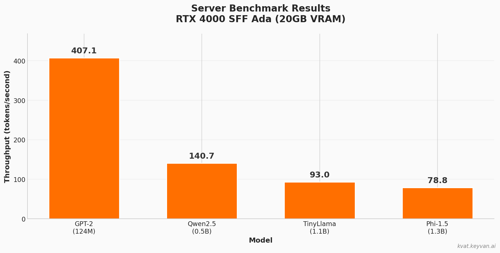
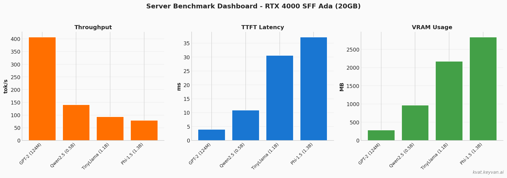

# KVCache Auto-Tuner

<p align="center">
  <a href="https://github.com/Keyvanhardani/kvcache-autotune/actions"></a>
  <a href="https://pypi.org/project/kvat/"></a>
  <a href="https://www.npmjs.com/package/kvat"></a>
  <a href="https://pypi.org/project/kvat/"></a>
  <a href="https://github.com/Keyvanhardani/kvcache-autotune/blob/main/LICENSE"></a>
</p>

<p align="center">
  <a href="README.md">English</a> | <a href="README_DE.md">Deutsch</a> | <strong>Francais</strong> | <a href="README_ES.md">Espanol</a> | <a href="README_FA.md">فارسی</a> | <a href="README_AR.md">العربية</a>
</p>

---

## Pourquoi kvat?

Lorsque vous executez des LLMs avec HuggingFace Transformers, il existe **des dizaines d'options de configuration** qui affectent les performances:

| Parametre | Options | Impact |
|-----------|---------|--------|
| Strategie de cache | dynamic, static, sliding_window | Memoire, vitesse prefill |
| Backend Attention | sdpa_flash, eager, math, mem_efficient | Debit, VRAM |
| Type de donnees | bfloat16, float16, float32 | Vitesse vs precision |

**Le probleme:** La combinaison optimale depend de VOTRE modele + VOTRE GPU + VOTRE cas d'utilisation. Personne ne sait quelle configuration est la meilleure sans tester.

**La solution:** `kvat` benchmarke automatiquement toutes les combinaisons et vous indique la configuration la plus rapide.

```bash
# Avant: Deviner et tester manuellement
model = AutoModelForCausalLM.from_pretrained("gpt2")  # Config par defaut - lent

# Apres: Laissez kvat trouver la meilleure config en 2 minutes
pip install kvat[full]
kvat tune gpt2 --profile ci-micro
# Sortie: "Best: dynamic/sdpa_flash/bfloat16 = 120 tok/s (+2.7% plus rapide)"
```

---

## Installation

```bash
pip install kvat[full]
```

---

## Demarrage rapide

```bash
# Optimiser n'importe quel modele HuggingFace
kvat tune meta-llama/Llama-3.2-1B --profile chat-agent

# Test rapide (recommande pour le premier essai)
kvat tune gpt2 --profile ci-micro

# Afficher les informations systeme
kvat info
```

---

## Resultats de benchmark

### Desktop (RTX 4060 - 8GB VRAM)

| Modele | Baseline | Avec kvat | Amelioration |
|--------|----------|-----------|--------------|
| GPT-2 (124M) | 118.1 tok/s | 120.2 tok/s | **+1.8%** |
| Qwen2.5-0.5B | 28.7 tok/s | 29.5 tok/s | **+2.7%** |
| Phi-1.5 (1.3B) | 45.2 tok/s | 45.6 tok/s | **+0.9%** |

### Serveur (RTX 4000 SFF Ada - 20GB VRAM)

| Modele | Debit | TTFT | Meilleure config |
|--------|-------|------|------------------|
| GPT-2 (124M) | **407.1 tok/s** | 4.0ms | dynamic/sdpa_flash |
| Qwen2.5-0.5B | **140.7 tok/s** | 10.9ms | dynamic/sdpa_flash |
| TinyLlama-1.1B | **93.0 tok/s** | 30.6ms | static/eager |
| Phi-1.5 (1.3B) | **78.8 tok/s** | 37.2ms | static/eager |

<p align="center">
  
</p>

<p align="center">
  
</p>

---

## Profils

| Profil | Longueur contexte | Longueur sortie | Ideal pour |
|--------|-------------------|-----------------|------------|
| `ci-micro` | 512 | 32 | Tests rapides |
| `chat-agent` | 2-8K | 64-256 | Chatbots, faible latence |
| `rag` | 8-32K | 256-512 | Pipelines RAG |
| `longform` | 4-8K | 1-2K | Generation de texte long |

---

## Sortie

Apres l'optimisation, kvat genere:

```
results/
├── best_plan.json      # Config complete en JSON
├── optimized_config.py # Code Python pret a l'emploi
├── report.md           # Rapport lisible
└── report.html         # Rapport visuel avec graphiques
```

---

## Licence

Apache 2.0

## Citation

```bibtex
@software{kvat,
  title = {KVCache Auto-Tuner: Optimisation automatique du KV-Cache pour Transformers},
  author = {Keyvanhardani},
  year = {2026},
  url = {https://github.com/Keyvanhardani/kvcache-autotune}
}
```

---

<p align="center">
  <a href="https://keyvan.ai"><strong>Keyvan.ai</strong></a> | <a href="https://www.linkedin.com/in/keyvanhardani">LinkedIn</a>
</p>
<p align="center">
  Fabrique en Allemagne avec passion pour la communaute HuggingFace
</p>
